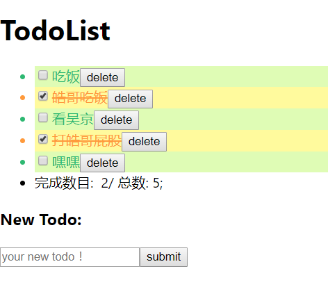

<!--
 * @Description: To describe this project
 * @Author: chenzh
 * @Date: 2019-10-11 10:24:32
 * @LastEditTime: 2019-10-14 19:20:18
 * @LastEditors: chzh
 -->

# react_todolist

## 功能展示



## 项目开发步骤记录

1. 使用创建单页应用

2. 删除不需要的部分：/src内的全部内容

3. ~~在/src内新建index.css与index.js~~

4. ~~引入ant-design
   `npm install antd`~~

5. ~~引入按需加载的babel，否则会打包整个文件，很大
   `npm i babel-plugin-import -D`~~

6. 设计使用三个components,listItem与todo由todolist总体管理

7. 逻辑：前两个组件全部采用可控组件的编写方式：只通过props控制，没有state

8. 函数：
代码中需要注意的部分：
```jsp
 <ListItem
    item={item}
    // 这里不写key的话会报错
    key={index}
    changeStatus={(id) => this.handleChangeStatus(id)}
    itemDelete={(id) => this.handleItemDelete(id)}
    />
```
```jsp
<input
    type="checkbox"
    defaultChecked={item.status}
    onClick={() => this.props.changeStatus(item.id)}
/>
```